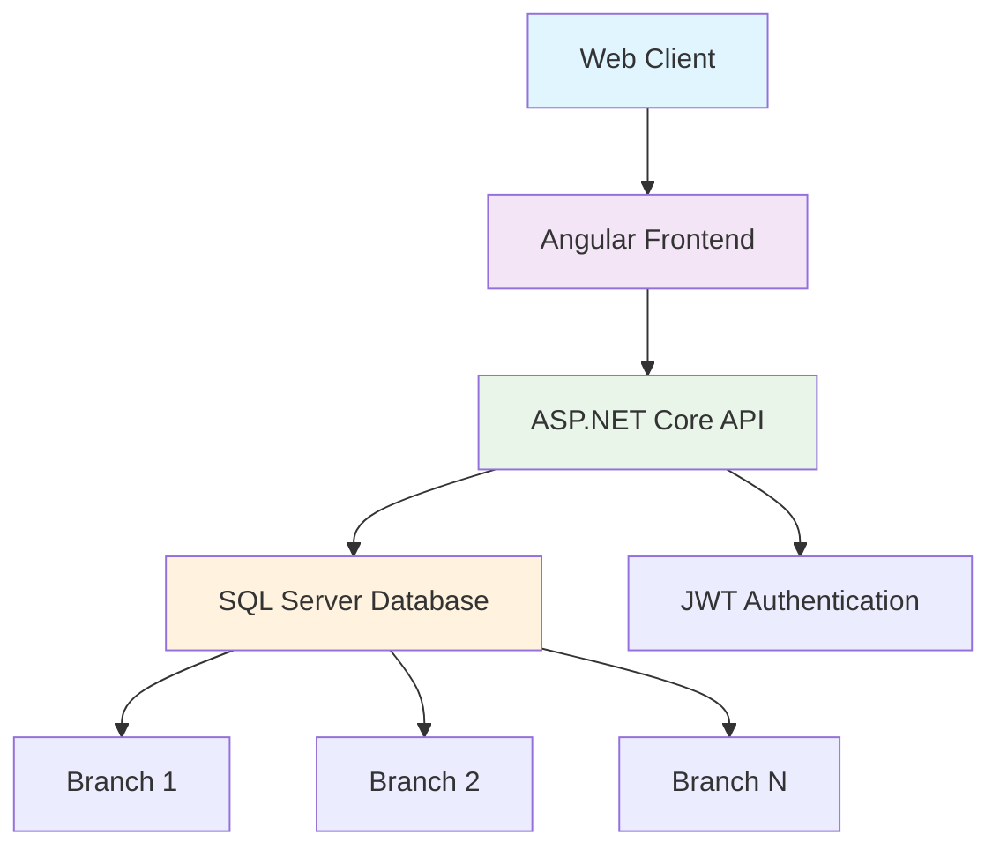

# 🍸 Bar Management System - La Última Copa


A comprehensive bar management system specifically designed for **La Última Copa SAS**. This web application optimizes multi-branch operations with real-time inventory control, order management, and detailed reporting.

## ✨ Key Features

### 🏢 Multi-Branch Management
- **Independent inventory control** per branch
- **Consolidated reports** for administrators
- **Branch-specific user access**

### 📱 Order Management System
- **Web-based order taking** with responsive design
- **Table status management** (Available/Occupied)
- **Order cancellation** with payment method tracking

### 📊 Real-Time Inventory
- **Stock tracking** per branch
- **Automatic updates** with each sale/purchase
- **Complete product management** (code, name, category, cost, price)

### 👥 Role-Based Access Control
| Role | Permissions |
|------|-------------|
| **Waiter** | Take orders (cannot modify/delete after registration) |
| **Cashier** | Close orders, register payments, generate branch reports |
| **Administrator** | Full access, global reports, user and role management |

### 📈 Reporting & Analytics
- **Exportable reports** in Excel (.xls)
- **Advanced filters** by date range, branch, and product code
- **Key metrics**: quantity, cost, price, profit margin

## 🛡️ Security

### 🔒 Security Measures
- **Password encryption** compliant with ISO 27001:2022
- **Automatic session timeout** after 3 minutes of inactivity
- **User deactivation** (no permanent deletion)
- **Password recovery** handled by administrators

## 🚀 Technology Stack

### Backend
- **ASP.NET Core** - Main framework
- **Entity Framework** - Database ORM
- **JWT** - Authentication and authorization

### Frontend
- **Angular** - Single-page application framework
- **TypeScript** - Programming language
- **Bootstrap** - Responsive CSS framework

### Database
- **Microsoft SQL Server** - Database management system
- **Stored Procedures** - Business logic in database

## 📋 Project Scope

### ✅ Included
- [x] Table management module
- [x] Order processing system
- [x] Inventory control
- [x] Sales reporting
- [x] User management and security
- [x] Initial training and user documentation

### ❌ Excluded
- Legal/tax invoicing
- Customer management
- Reservation system
- Promotions and combos
- External system integrations
- Native mobile applications
- Hardware provision
- Automated backups

## 🏗️ System Architecture



## 📊 Reporting Structure

| Report Type | Available Filters | Output Format |
|-------------|-------------------|---------------|
| **Sales by Branch** | Date, Product, Waiter | Excel, Screen |
| **Inventory** | Branch, Category | Excel, Screen |
| **Performance** | Period, Branch | Excel, Charts |

## 🔧 Installation & Configuration

### Prerequisites
- .NET 6.0 SDK or higher
- Angular CLI 15.0 or higher
- SQL Server 2019 or higher
- Node.js 16.0 or higher

### Installation Steps
```bash
# Clone repository
gh repo clone LuisFCosteC/BARSTOC
```

## 👥 User Roles

### Waiter
- View available tables
- Take orders
- Check available inventory

### Cashier
- All waiter functions
- Close orders and register payments
- Generate branch reports

### Administrator
- All previous functions
- Complete user management
- Global multi-branch reports
- System configuration

## 🔄 Future Updates

### Upcoming Versions
- [ ] Online reservation system
- [ ] Mobile app for customers
- [ ] Payment gateway integration
- [ ] Real-time dashboard
- [ ] Loyalty program system

---

**© 2025 LFCC** - *System developed to optimize restaurant management operations*